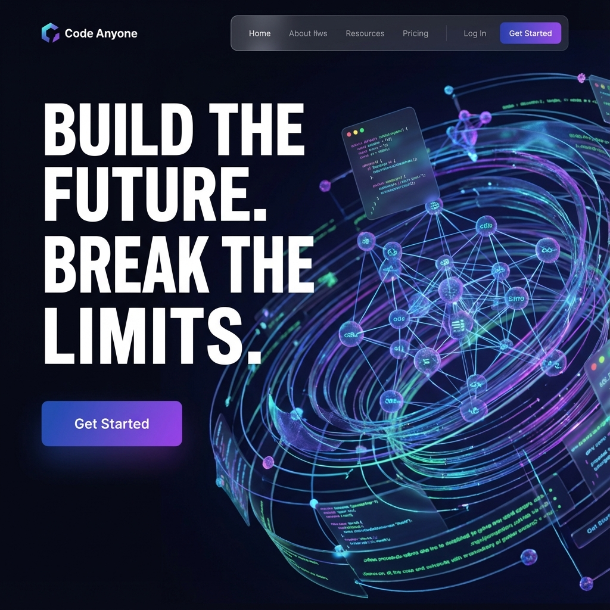
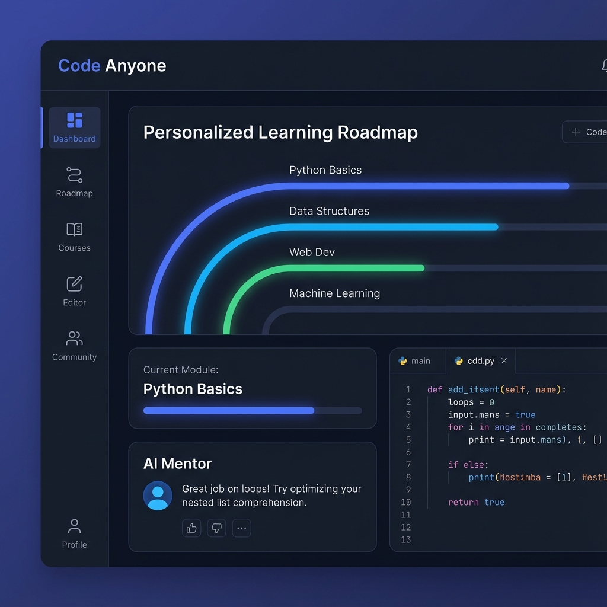

# Code Anyone 🚀

   

> **Build the Future. Break the Limits.**  
> A personalized, AI-powered coding mentorship platform that adapts to *your* learning style.

---

## 📸 At a Glance

<p align="center">
  
  
</p>

## ✨ Why Code Anyone?

We don't just teach code; we adapt to **you**.
*   **🎨 Visual Learners**: Concepts explained via recipes, traffic lights, and blocks.
*   **💼 Career Switchers**: Fast-track to industry standards and CI/CD.
*   **🏗️ Builders**: Learn by shipping real tools and solving actual problems.

## ⚡ Key Features

*   **🧠 AI Curriculum Engine**: Generates unique learning paths based on your persona.
*   **💬 Instant AI Mentorship**: 24/7 help with debugging and explanations.
*   **📮 Professional Contact System**: Full-cycle ticket management with AI-drafted replies.
*   **🔒 Secure Auth**: Enterprise-grade Google & GitHub OAuth.

## 🛠️ The Stack

| Domain | Technologies |
|--------|--------------|
| **Frontend** | React, TypeScript, TailwindCSS, Vite, Lucide |
| **Backend** | Go (Golang), SQLite, SMTP (Email), JWT |
| **AI Core** | Google Gemini Flash 1.5 (via OpenRouter) |

## 🚀 Quick Start

**1. Clone & Config**
```bash
git clone https://github.com/yourusername/code-anyone.git
cd code-anyone
cp backend/.env.example backend/.env # Add your API keys!
```

**2. Launch Backend**
```bash
cd backend
go run cmd/api/main.go
# Server: :8081
```

**3. Launch Frontend**
```bash
cd frontend
npm install && npm run dev
# App: :3000
```

---
*Crafted with ❤️ by the Code Anyone Team*
